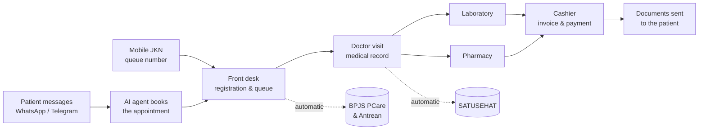

<p align="center">
  
</p>

<h3 align="center"><em>Saling jaga, sehat bersama.</em></h3>
<p align="center">Look after each other, stay healthy together.</p>

---

## What is Saling Jaga?

**Saling Jaga** is a clinic management system built for Indonesian healthcare facilities, starting with the *klinik pratama* (FKTP). The name means *"looking after one another"*, and that is the idea behind the product: the clinic looks after its patients, and the system looks after the clinic's paperwork.

It brings the whole visit into one place. A patient books on WhatsApp, checks in at the front desk, sees the doctor, collects medicine and pays. The medical record, lab results, prescriptions, invoice and government reporting are all handled along the way, so nobody types the same data twice.

### Why clinics use it

- **The front desk stops answering every chat by hand.** An AI agent on WhatsApp and Telegram answers common questions and books appointments on its own, and passes the conversation to staff when a person is needed.
- **Compliance is included.** The electronic medical record is built around the PMK 24/2022 requirements, and visits are sent to **SATUSEHAT** and **BPJS** automatically. BPJS data no longer has to be re-entered in a second browser tab.
- **BPJS patients don't have to queue in person.** Mobile JKN users can take a queue number from their phone, and the clinic's queue stays in sync with BPJS.
- **Everything stays connected.** A diagnosis becomes a lab order, a prescription, an invoice and a SATUSEHAT record without anyone re-entering it.
- **Patient data is protected by design.** National ID and BPJS numbers are encrypted, every look at patient data is logged, and staff only see what their role allows.

---

## Who it's for

Saling Jaga has three workspaces, and each person sees only what their role permits.

| Workspace | Who uses it | What they do there |
|---|---|---|
| **Admin back office** | Clinic owners, admins, front desk, cashiers, pharmacists, lab technicians | Run the clinic day to day: registration, appointments, lab, pharmacy, billing, rooms, documents, the WhatsApp/Telegram inbox, integrations and settings |
| **Doctor workspace** | Doctors | Their appointments and patients, visit notes, the AI clinical assistant, and a personal knowledge base |
| **Patient portal** | Patients | Their registrations and queue status, lab results and documents released to them |

Roles set up at install: **Super Admin, Admin, Doctor, Pharmacist, Lab Technician, Patient**. Clinics can create custom roles with their own permissions.

---

## A patient's journey



---

## Modules

### Front desk & patients

- **Patient Management**: register and update patients, import patients who already have a medical record number, and record consent to the privacy notice. Revealing a patient's NIK or BPJS number is a separate, logged action.
- **Registration & Queue**: the day's registration list, with queue numbers for the whole clinic and per *poli*, tracking each patient from arrival to finish.
- **Appointment Scheduling**: patients join a doctor's practice session. Special exact-time requests go to staff for approval, and each session shows its own queue.
- **Doctor–Patient Assignment**: assign a doctor to a patient, with a history of every change.

### Clinical care

- **Electronic Medical Record (EMR)**: open and close visits, write SOAP notes, and record vital signs, ICD-10 diagnoses, ICD-9-CM procedures, vaccinations and BPJS referrals (*rujukan*).
- **Laboratory**: the complete lab workflow. Test catalog and reference ranges; orders from a visit or walk-in; specimen collection and labels; result entry, verification and release; printable lab reports.
- **Pharmacy**: prescriptions, dispensing and printed *resep*, plus the medication catalog, stock receipts, inventory and expiry reports. Stock is taken from batches by expiry date.
- **Inpatient Care**: admit a patient to a bed, transfer them, and discharge them, alongside wards, rooms, bed classes and a live bed-occupancy board.
- **Medical Terminology**: searchable ICD-10 diagnosis and ICD-9-CM procedure codes.

### Billing & documents

- **Billing & Cashier**: a clinic price list that turns a finished visit into an invoice. Staff record payments, void invoices, print PDFs and close the day with a cashier report.
- **Document Templates**: design the clinic's invoice, lab request, prescription and lab report templates. Staff can import from Word, preview, version and publish them.
- **Clinical Forms**: printable lab request letters (*surat pengantar*) and prescriptions with barcodes, generated from those templates.
- **Document Delivery**: send invoices and clinical documents to patients over WhatsApp or email, as password-protected PDFs or a secure link. Each patient's consent is recorded per channel.
- **Document Library & Approvals**: a formal register for SOPs and policies, with drafts, approval workflows, version history and export.
- **Clinic Knowledge & Personal Vault**: the clinic's knowledge library (what the AI answers from), each doctor's personal knowledge base, and a private vault whose files are never shared with AI.

### People & organisation

- **Staff Management**: create staff accounts, invite new staff by email, and offboard leavers safely. Offboarding has an export-only grace period and can be undone.
- **Doctor Management**: doctor profiles, weekly schedules, specialties, and STR/SIP licence tracking with expiry warnings.
- **Organisation Structure**: the clinic's departments and who belongs to each.
- **Roles & Permissions**: fine-grained permissions, custom roles, and role assignment. Everything is denied unless a role allows it.

### Platform

- **Notifications**: an in-app notification bell for approvals, handed-over chats, expiring licences, lab results (including critical values) and document approvals.
- **Feature Switches**: each paid module can be switched on or off for each clinic.
- **Indonesian Regions**: province, regency, district and village lists for addresses.

---

## Integrations

### 🤖 AI Assistant

An AI assistant built into the workspace for **doctors** and **clinic staff**.

- **Answers from your clinic's own documents.** It searches the clinic's approved knowledge library and each doctor's personal knowledge base, and shows the passages it used.
- **Looks up live clinic data** such as today's appointments, a patient summary, the queue board, medication stock and expiry, or the daily cashier report. It only ever sees what the person asking is allowed to see.
- **Works with the AI provider the clinic chooses:** OpenAI, Azure OpenAI, Anthropic Claude, Google Gemini, DeepSeek, a self-hosted Ollama, or any OpenAI-compatible service. Each clinic enters its own API key, which is stored encrypted. Saling Jaga does not run AI models itself.
- **Can keep documents on-premise.** With a local embedding model (Ollama), the clinic's documents never leave its own infrastructure.

**Safety comes first.** The assistant never diagnoses and never prescribes. Every answer carries a disclaimer in Bahasa Indonesia and English, and emergency symptoms trigger a "go to the emergency room" reply. It will not state a clinic fact it hasn't actually looked up. Personal data is minimised before anything reaches the AI provider, uploaded documents are screened for prompt-injection attempts, and every conversation is kept for audit.

### 💬 WhatsApp & Telegram Customer Service

An AI customer-service agent that talks to patients where they already are.

- **Answers clinic questions**, such as opening hours, services and requirements, from the clinic's knowledge base.
- **Books appointments in the chat.** It shows available sessions and books the one the patient picks, with no admin typing needed.
- **Never collects sensitive data over chat.** NIK, BPJS number, address and medical details are completed at the clinic.
- **Hands over to a human** when the patient asks, when the bot is unsure, or when an emergency is detected. Staff work from a shared inbox where they can take over, reply, hand back and block abuse.
- **WhatsApp** runs through a self-hosted gateway (GOWA, with WAHA as a fallback) that admins pair by QR code from the dashboard. **Telegram** uses the official Bot API.

### 🇮🇩 SATUSEHAT

Saling Jaga sends clinical data to **SATUSEHAT**, the Ministry of Health's national health data platform, as the regulations require.

- Each **visit** is sent with its diagnoses, observations, procedures, vaccinations, allergies, medications, prescriptions and dispensing. Each **lab report** is sent with its specimens and results.
- Patients and doctors are matched to their SATUSEHAT (IHS) identities.
- Sending happens in the background. Failed submissions retry automatically, and admins can see every submission and retry it by hand. When a record is ambiguous (for example, two possible matches for one patient), it is set aside for a person to resolve rather than guessed.

### 🏥 BPJS PCare

A bridge to **BPJS Kesehatan's PCare** system for JKN patients.

- Check a patient's **BPJS eligibility** at registration.
- Send **registrations, visits (*kunjungan*) and drugs** to PCare automatically. The receptionist's second browser tab is no longer needed.
- Map the clinic's doctors, *poli* and medicines to BPJS codes, and keep BPJS reference lists in sync.
- Retry failed submissions, and review a **monthly reconciliation report** of what was recorded, sent and failed.

### 📱 BPJS Antrean Online (Mobile JKN)

Connects the clinic's queue to **Mobile JKN**, the national JKN app.

- BPJS patients can **take, check and cancel a queue number** from their phone, and new patients can register.
- The clinic's own queue progress (added, called, cancelled) is published back to BPJS.
- The doctor schedule held by BPJS (HFIS) is compared with the schedule in Saling Jaga, so differences are caught early.
- The endpoints BPJS calls are protected and every call is logged.

### ✉️ Email & PDF

- **Email** for staff invitations and document delivery, through any SMTP provider.
- **PDF generation** for invoices, lab reports, prescriptions and clinical forms. Documents can be password-protected before they are sent to a patient.

---

## Security & privacy

- National ID (NIK) and BPJS numbers are **encrypted at rest**, and revealing one is a separate, logged action.
- An **access log** shows who viewed which patient's data.
- **Two-factor sign-in** (authenticator app plus recovery codes) is required for accounts with sensitive permissions.
- Idle sessions time out, and a shared workstation can be handed from one user to another.
- Permissions are **deny-by-default**. Every action is checked on the server, not just hidden in the interface.

## Languages

The interface is fully bilingual in **Bahasa Indonesia** (default) and **English**, and each user picks their own language.

---

## Running Saling Jaga

### Environment setup

All configuration lives in [`apps/api/.env.example`](apps/api/.env.example). Every setting is documented there, including what it does, whether it's required and how to generate secrets. Copy it and fill in what you need:

```bash
cp apps/api/.env.example apps/api/.env
```

The web app needs no environment file for local development.

### Option 1: Docker

**Requirements:** Docker, Node.js ≥ 20.19 and pnpm ≥ 10 (for the helper commands).

1. Install dependencies and build the shared package, which the API image uses:

```bash
pnpm install
```

```bash
pnpm --filter @hms/shared-types build
```

2. Start the database and file storage:

```bash
pnpm docker:dev:up
```

3. Set up the database, then load the default roles, permissions and reference data:

```bash
pnpm docker:dev:migrate
```

```bash
docker compose -f infra/docker/docker-compose.dev.yml --profile tools run --rm migrate pnpm --filter @hms/api prisma:seed
```

4. Start the API and the web app:

```bash
pnpm docker:dev:start
```

Open **http://localhost:3000** for the app and **http://localhost:3001/api/docs** for the API reference.

Optional services can be started when you need them:

| Service | Needed for | Command |
|---|---|---|
| PDF renderer | Invoices, lab reports and printed forms | `pnpm docker:dev:pdf` |
| WhatsApp gateway | The WhatsApp customer-service channel | `docker compose -f infra/docker/docker-compose.dev.yml --profile whatsapp-gowa up -d gowa` |
| HTTPS proxy | Testing behind TLS locally | `docker compose -f infra/docker/docker-compose.dev.yml --profile tls up -d` |

To stop everything:

```bash
pnpm docker:dev:down
```

### Option 2: Local

**Requirements:** Node.js ≥ 20.19, pnpm ≥ 10, and Docker for the database and file storage.

1. Install dependencies:

```bash
pnpm install
```

2. Start the database and file storage:

```bash
pnpm docker:dev:up
```

3. Build the shared package:

```bash
pnpm --filter @hms/shared-types build
```

4. Set up the database and load the default data:

```bash
pnpm db:migrate:deploy
```

```bash
pnpm db:seed
```

5. Start the API (port 3001) and the web app (port 3000):

```bash
pnpm dev
```

---

## Learn more

- [`docs/`](docs/): product, architecture, security and operations documentation
- [`docs/customer-service/`](docs/customer-service/): how the WhatsApp and Telegram agent works
- [`docs/post-mvp/`](docs/post-mvp/): AI assistant, SATUSEHAT, BPJS PCare and BPJS Antrean design notes
- [`AGENTS.md`](AGENTS.md) and [`CLAUDE.md`](CLAUDE.md): engineering conventions for contributors
